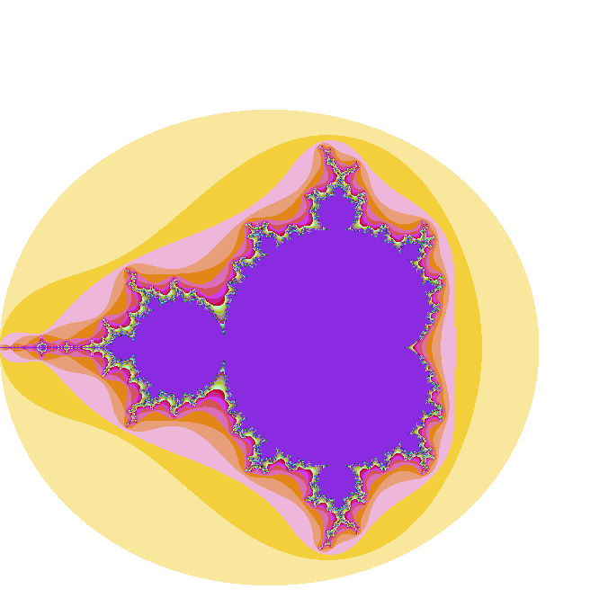
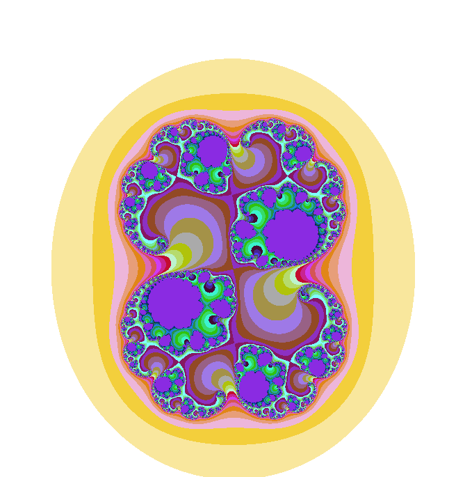
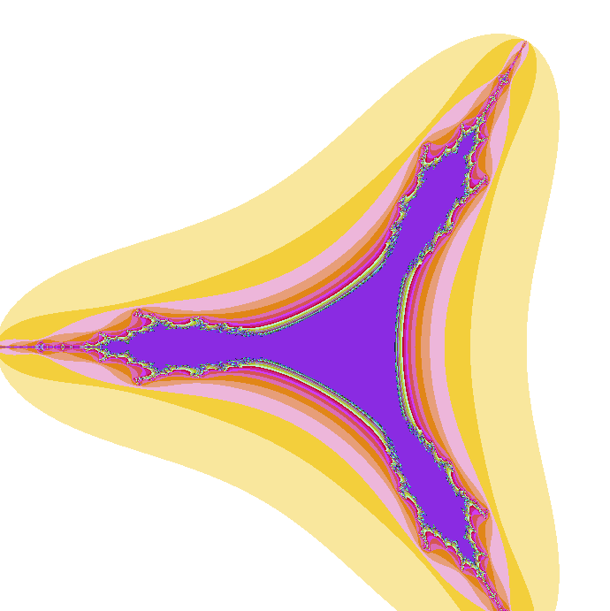

# 🌀 Fractol

**Fractol** es un programa interactivo que permite explorar conjuntos fractales a través de una interfaz gráfica basada en MiniLibX. El proyecto se centra en renderizar los conjuntos **Mandelbrot** y **Julia**, con soporte para zoom infinito, efectos de color y personalización desde la línea de comandos.

---

## ❓ ¿Qué es un Fractal?

Un **fractal** es una figura geométrica compleja que muestra auto-similitud a diferentes escalas. Dos de los más conocidos son:

- **Conjunto de Mandelbrot**: generado aplicando repetidamente la fórmula  
  \[
  z_{n+1} = z_n^2 + c
  \]
  comenzando con \( z_0 = 0 \). Si la secuencia permanece acotada, el punto pertenece al conjunto.
  
   

- **Conjunto de Julia**: utiliza la misma fórmula, pero con un número complejo fijo \( c \), mientras se varía el valor inicial \( z_0 \). Diferentes valores de \( c \) generan distintos patrones fractales.

  
  
- **Conjunto de Tricorn**: variante del Mandelbrot que usa la fórmula  
  `zₙ₊₁ = conj(zₙ)² + c`  
  (conjugado complejo de `z`), lo que genera una simetría distintiva y patrones más puntiagudos.
  
   
---

## ✨ Características Principales

- ✅ Soporte para fractales:
  - **Mandelbrot**
  - **Julia** (con parámetros personalizados)
  -  **Tricorn** (*bonus* )
  
- 🔍 **Zoom interactivo** usando la rueda del ratón

- 🎨 **Representación gráfica** mediante MiniLibX

- 🌈 **Efectos de color** para visualizar profundidad

- 🛑 **Salida limpia** al presionar `ESC` o cerrar la ventana

---

## 🎮 Controles

| Acción                      | Efecto                        |
|-----------------------------|-------------------------------|
| **Rueda del ratón**         | Zoom in/out en la imagen      |
| **ESC**                     | Cierra la ventana y sale      |
| **Botón de cerrar ventana** | Cierra la ventana y sale      |

---

## ⚙️ Argumentos del Programa

```bash
./fractal <fractal_type> [options]
```

- `fractal_type`: Tipo de fractal a mostrar. Opciones:
  - `Mandelbrot`
  - `Julia`
  - Tricorn
  
- `[options]`: Solo para Julia. Dos números reales que representan las partes real e imaginaria de la constante \( c \). Ejemplo:
  - `./fractal Julia -0.7 0.27015`

---

## 🧪 Ejemplos de Uso

### 🧱 Compilación

```bash
make
```

### ▶️ Ejecutar Mandelbrot

```bash
./fractal Mandelbrot
```

### ▶️ Ejecutar Julia (con parámetros)

```bash
./fractal Julia -0.7 0.27015
```

### ▶️ Ejecutar Tricorn

```bash
./fractal Tricorn
```
---
